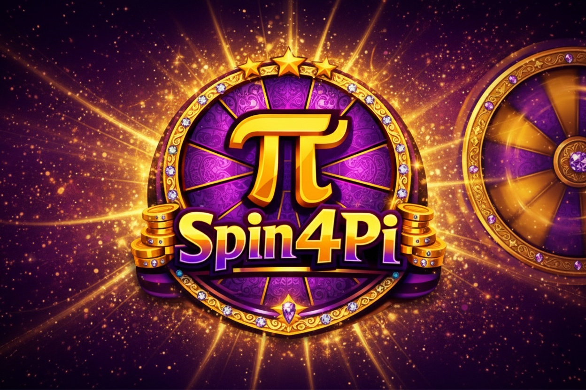

<p align="center">
  
</p>

<h1 align="center">🎰 Spin4Pi — The Ultimate Pi Network Gaming Experience</h1>

<p align="center">
  <strong>A revolutionary spin-to-win entertainment platform fully integrated with Pi Network SDK & API</strong>
</p>

<p align="center">
  
  
  
  
</p>

<p align="center">
  
  
  
  
  
</p>

---

## 📋 Table of Contents

- [🌟 Vision & Mission](#-vision--mission)
- [🎮 Core Features](#-core-features)
- [💰 S4P Token Economy](#-s4p-token-economy)
- [🏗️ Technical Architecture](#️-technical-architecture)
- [🗺️ Complete Application Map](#️-complete-application-map)
- [🔐 Security & Compliance](#-security--compliance)
- [🌍 Community Impact](#-community-impact)
- [🚀 Roadmap](#-roadmap)
- [📚 API Reference](#-api-reference)
- [🛠️ Developer Guide](#️-developer-guide)
- [📄 Legal & Compliance](#-legal--compliance)

---

## 🌟 Vision & Mission

### Vision
To become the **premier entertainment platform** on Pi Network, demonstrating the real-world utility of Pi cryptocurrency while providing a fun, fair, and rewarding gaming experience.

### Mission
- **Educate** users about Pi Network's payment ecosystem through hands-on experience
- **Demonstrate** real Pi transactions in an entertaining context
- **Build** a sustainable digital economy with the S4P token
- **Empower** the Pi community with rewards and engagement opportunities

---

## 🎮 Core Features

### 🎡 Advanced Spin System
| Feature | Description |
|---------|-------------|
| **Daily Free Spin** | One free spin every 24 hours with server-verified cooldown |
| **Paid Spins** | Multiple tiers (0.1π, 0.5π, 1.0π) with proportional rewards |
| **Ad-Powered Spins** | Watch 3+ Pi Ads to earn a bonus spin + S4P tokens |
| **Smart Outcomes** | AI-balanced reward distribution for fair gameplay |

### 💎 Progressive Jackpot
- **Real-time pool** that grows with every paid spin
- **5% contribution** from each spin goes to jackpot
- **Live updates** via WebSocket for instant visibility
- **Celebration animations** with confetti & sound effects

### 🏆 VIP Tier System
| Tier | Required Spins | Benefits |
|------|----------------|----------|
| Bronze | 0+ | Base rewards |
| Silver | 50+ | +10% bonus multiplier |
| Gold | 200+ | +25% bonus, 5% spin discount |
| Platinum | 500+ | +50% bonus, 10% discount |
| Diamond | 1000+ | +100% bonus, 20% discount, exclusive NFTs |

### 🎯 Achievement System
- **25+ Unlockable Badges** across multiple categories
- **Pi Rewards** for milestone achievements
- **S4P Token Bonuses** for rare achievements
- **Social Sharing** via Pi Network SDK

### 🏅 Tournament System
- **Weekly Competitions** with prize pools
- **Real-time Leaderboards** with live ranking
- **Entry Fees** in Pi for premium tournaments
- **Community Rewards** for top performers

### 🛒 NFT Marketplace
- **Utility NFTs** that provide gameplay boosts
- **Multiplier NFTs** (1.5x, 2x, 3x reward boosters)
- **Lucky Charm NFTs** (increased jackpot chance)
- **Exclusive Skins** for wheel customization

### 📊 Staking System
| Tier | Lock Period | APY | Boost |
|------|-------------|-----|-------|
| Flexible | None | 5% | 1.0x |
| Bronze | 30 days | 8% | 1.2x |
| Silver | 60 days | 12% | 1.5x |
| Gold | 90 days | 18% | 2.0x |

### 🤝 Referral Program
- **10% Commission** on referred users' spins
- **Welcome Bonus** for new referrals
- **Unlimited Referrals** with no cap
- **Real-time Tracking** of earnings

---

## 💰 S4P Token Economy

### What is S4P?
**S4P (Spin4Pi Token)** is the in-app utility token designed for integration with **Pi DEX Testnet**.

### Token Utility
- 🎁 **Rewards**: Earn S4P from ads, achievements, and jackpots
- 🛒 **Marketplace**: Purchase NFTs and boosts with S4P
- 🎰 **Spins**: Use S4P for discounted spin entries
- 💱 **Trading**: Trade on Pi DEX (coming soon)

### Earning S4P
| Action | S4P Reward |
|--------|------------|
| Watch Ad | 10 S4P |
| Daily Login | 5-50 S4P (streak based) |
| Achievement Unlock | 10-500 S4P |
| Jackpot Bonus | 100+ S4P |
| Referral Bonus | 25 S4P per referral |

---

## 🏗️ Technical Architecture

```
┌─────────────────────────────────────────────────────────────────────┐
│                         SPIN4PI ARCHITECTURE                        │
├─────────────────────────────────────────────────────────────────────┤
│                                                                     │
│  ┌─────────────┐    ┌─────────────┐    ┌─────────────────────────┐ │
│  │   Pi SDK    │◄──►│   Frontend  │◄──►│   Lovable Cloud         │ │
│  │   v2.0      │    │   React 18  │    │   (Supabase)            │ │
│  └─────────────┘    └─────────────┘    └─────────────────────────┘ │
│         │                  │                       │                │
│         ▼                  ▼                       ▼                │
│  ┌─────────────┐    ┌─────────────┐    ┌─────────────────────────┐ │
│  │ Pi.authenticate│ │  Tailwind   │    │   Edge Functions        │ │
│  │ Pi.createPayment│ │  Framer    │    │   • spin-result         │ │
│  │ Pi.openShareDialog│ │ Motion   │    │   • complete-payment    │ │
│  └─────────────┘    └─────────────┘    │   • withdraw-pi         │ │
│                                        │   • get-leaderboard     │ │
│                                        │   • daily-login         │ │
│                                        │   • check-achievements  │ │
│                                        │   • +15 more            │ │
│                                        └─────────────────────────┘ │
│                                                     │               │
│                                                     ▼               │
│                                        ┌─────────────────────────┐ │
│                                        │   PostgreSQL Database   │ │
│                                        │   • profiles            │ │
│                                        │   • spins               │ │
│                                        │   • achievements        │ │
│                                        │   • tournaments         │ │
│                                        │   • nft_assets          │ │
│                                        │   • staking             │ │
│                                        │   • payments            │ │
│                                        │   • withdrawals         │ │
│                                        └─────────────────────────┘ │
│                                                                     │
└─────────────────────────────────────────────────────────────────────┘
```

### Tech Stack

| Layer | Technology | Purpose |
|-------|------------|---------|
| **Frontend** | React 18 + TypeScript | UI Components |
| **Styling** | Tailwind CSS + shadcn/ui | Design System |
| **Animation** | Framer Motion | Smooth Transitions |
| **State** | TanStack Query | Server State Management |
| **Backend** | Supabase Edge Functions | Serverless Logic |
| **Database** | PostgreSQL + RLS | Secure Data Storage |
| **Auth** | Pi SDK v2.0 | Pi Network Authentication |
| **Payments** | Pi SDK v2.0 | Real Pi Transactions |
| **Realtime** | Supabase Channels | Live Updates |

---

## 🗺️ Complete Application Map

```
SPIN4PI APPLICATION STRUCTURE
═══════════════════════════════════════════════════════════════════

📱 PAGES
├── 🏠 Home (/)
│   ├── Hero Section with Animated Logo
│   ├── Jackpot Counter (Real-time)
│   ├── Spin Wheel (3D Animated)
│   ├── Spin Buttons (Free/Paid)
│   ├── VIP Status Card
│   ├── Tournament Panel
│   ├── Leaderboard (Top 5)
│   ├── Staking Panel
│   ├── Referral Panel
│   └── Features Showcase
│
├── 👤 Profile (/profile)
│   ├── User Stats Dashboard
│   ├── Pi Wallet Balance
│   ├── S4P Token Balance
│   ├── Spin History
│   ├── Deposit Pi
│   ├── Withdraw Pi
│   └── Notification Settings
│
├── 🏆 Achievements (/achievements)
│   ├── All Badges Grid
│   ├── Progress Tracking
│   ├── Reward Claims
│   └── Achievement History
│
├── 👑 VIP Benefits (/vip)
│   ├── Tier Progress
│   ├── Current Benefits
│   ├── Upgrade Requirements
│   └── Exclusive Rewards
│
├── 🛒 Marketplace (/marketplace)
│   ├── NFT Grid
│   ├── My Collection
│   ├── Equipped Items
│   └── Purchase History
│
├── 💸 Withdrawal History (/withdrawals)
│   ├── Transaction List
│   ├── Status Tracking
│   └── Export Options
│
├── ⚙️ Admin (/admin)
│   ├── User Management
│   ├── Tournament Control
│   ├── Jackpot Management
│   └── Analytics Dashboard
│
└── 📜 Legal (/legal)
    ├── Terms of Service
    └── Privacy Policy

🧩 COMPONENTS (40+)
├── Core
│   ├── Header (Navigation + Auth)
│   ├── Footer (Links + Info)
│   ├── MobileMenu (Hamburger)
│   └── GlobalLoading (Splash)
│
├── Game
│   ├── SpinWheel (3D Animated)
│   ├── SpinButtons (Free/Paid)
│   ├── JackpotCounter (Animated)
│   ├── JackpotPopup (Winner)
│   └── ResultModal (Win/Lose)
│
├── Social
│   ├── Leaderboard
│   ├── ReferralPanel
│   ├── TournamentPanel
│   └── AchievementBadges
│
├── Economy
│   ├── DepositModal
│   ├── WithdrawModal
│   ├── StakingPanel
│   ├── S4PToken
│   └── PiPriceDisplay
│
├── VIP
│   ├── VIPStatus
│   ├── ActiveBoostsIndicator
│   └── AchievementUnlockModal
│
└── Utility
    ├── SoundControls
    ├── NotificationSettings
    ├── DailyRewardButton
    ├── AdSpinReward
    └── BackendHealthCheck

🪝 HOOKS (15+)
├── usePiAuth (Pi SDK Authentication)
├── usePiPayment (Pi Payments)
├── usePiShare (Social Sharing)
├── useSpin (Spin Logic)
├── useSpinHandler (Spin Events)
├── useWallet (Balance Management)
├── useGameData (Leaderboard + Jackpot)
├── useGameUnified (Combined State)
├── useSoundEffects (Audio)
├── useNotifications (Push Alerts)
├── useKeyboardShortcuts (Accessibility)
└── useMobile (Responsive)

⚡ EDGE FUNCTIONS (20+)
├── Authentication
│   ├── daily-login
│   └── check-admin-access
│
├── Payments
│   ├── deposit-pi
│   ├── complete-deposit
│   ├── withdraw-pi
│   ├── approve-payment
│   └── complete-payment
│
├── Game Logic
│   ├── spin-result
│   ├── daily-spin
│   ├── claim-ad-spin
│   └── get-leaderboard
│
├── Features
│   ├── apply-referral
│   ├── check-achievements
│   ├── create-tournament
│   ├── end-tournament
│   ├── cron-end-tournaments
│   └── send-streak-reminder
│
├── NFT
│   ├── get-nfts
│   ├── purchase-nft
│   └── equip-nft
│
└── Utility
    └── get-pi-price

🗄️ DATABASE TABLES (16)
├── profiles (Users)
├── spins (Spin History)
├── achievements (Badge Definitions)
├── user_achievements (Unlocked)
├── tournaments (Competitions)
├── tournament_entries (Participants)
├── vip_tiers (Tier Definitions)
├── nft_assets (NFT Catalog)
├── nft_ownership (User NFTs)
├── staking (Stake Records)
├── jackpot (Prize Pool)
├── payments (Transactions)
├── deposits (Incoming Pi)
├── withdrawals (Outgoing Pi)
├── shares (Social Actions)
├── referral_rewards (Commissions)
├── admin_roles (Permissions)
├── s4p_transactions (Token History)
└── ad_spin_claims (Ad Rewards)
```

---

## 🔐 Security & Compliance

### Pi Network Compliance
- ✅ **Pi SDK v2.0** official integration
- ✅ **Server-side verification** for all transactions
- ✅ **No gambling claims** - entertainment only
- ✅ **No guaranteed profit** messaging
- ✅ **Proper payment callbacks** implementation

### Backend Security
- 🔒 **Row Level Security (RLS)** on all tables
- 🔒 **Service Role** for financial operations
- 🔒 **Input Validation** with Zod schemas
- 🔒 **CORS** protection on Edge Functions
- 🔒 **Pi Token Verification** for authentication

### Data Protection
- 🛡️ **Encrypted secrets** management
- 🛡️ **No client-side wallet updates**
- 🛡️ **Audit logging** for transactions
- 🛡️ **Rate limiting** on sensitive endpoints

---

## 🌍 Community Impact

### For Pi Pioneers
- 🎮 **Entertainment** - Fun gaming experience
- 📚 **Education** - Learn Pi payments hands-on
- 💰 **Rewards** - Earn Pi and S4P tokens
- 🤝 **Community** - Compete with friends

### For Pi Network Ecosystem
- 🚀 **Adoption** - Demonstrates real Pi utility
- 💱 **Economy** - Creates transaction volume
- 🏗️ **Infrastructure** - Reference implementation
- 📊 **Data** - Usage analytics for network growth

### For Developers
- 📖 **Open Documentation** - Learn from our code
- 🔧 **Best Practices** - Pi SDK integration patterns
- 🎨 **UI Components** - Reusable game components
- 🏛️ **Architecture** - Scalable backend design

---

## 🚀 Roadmap

### Phase 1: Foundation ✅
- [x] Core spin mechanics
- [x] Pi SDK authentication
- [x] Pi payments integration
- [x] Jackpot system
- [x] Leaderboard
- [x] Achievement system

### Phase 2: Economy ✅
- [x] S4P Token implementation
- [x] VIP tier system
- [x] Staking feature
- [x] NFT marketplace
- [x] Referral program

### Phase 3: Engagement 🚧
- [x] Tournament system
- [x] Daily login rewards
- [x] Ad-powered spins
- [ ] Push notifications
- [ ] Email reminders

### Phase 4: Expansion 📋
- [ ] Pi DEX listing (S4P)
- [ ] Multi-language support
- [ ] Mobile app optimization
- [ ] Community governance
- [ ] Partner integrations

---

## 📚 API Reference

### Edge Functions

#### `spin-result`
```typescript
POST /spin-result
Body: { piUsername: string, spinType: string, cost: number }
Returns: { success: boolean, result: SpinResult }
```

#### `get-leaderboard`
```typescript
GET /get-leaderboard
Returns: { leaderboard: Player[], jackpot: number }
```

#### `complete-payment`
```typescript
POST /complete-payment
Body: { paymentId: string, txid: string }
Returns: { success: boolean }
```

*Full API documentation available in `/docs/api.md`*

---

## 🛠️ Developer Guide

### Prerequisites
- Node.js 18+
- npm or bun
- Pi Network Developer Account
- Lovable Cloud Account

### Environment Variables
```env
VITE_SUPABASE_URL=your_supabase_url
VITE_SUPABASE_PUBLISHABLE_KEY=your_anon_key
```

### Local Development
```bash
# Clone repository
git clone https://github.com/EslaM-X/spin4pi-vault.git

# Install dependencies
npm install

# Start development server
npm run dev
```

### Deployment
Frontend deploys automatically via Lovable. Edge functions deploy on file save.

---

## 📄 Legal & Compliance

### Important Disclaimers
- Spin4Pi is an **entertainment platform**, not a gambling service
- No guaranteed profits or returns
- All rewards are **probabilistic** based on fair algorithms
- Users must be 18+ and comply with local regulations

### Documentation
- [Terms of Service](/TERMS.md)
- [Privacy Policy](/PRIVACY.md)

---

## 🔗 Links

| Resource | URL |
|----------|-----|
| **Live App** | [spin4pi.lovable.app](https://spin4pi.lovable.app) |
| **GitHub** | [github.com/EslaM-X/spin4pi-vault](https://github.com/EslaM-X/spin4pi-vault) |
| **Pi Network** | [minepi.com](https://minepi.com) |
| **Documentation** | [docs.spin4pi.app](https://docs.spin4pi.app) |

---

## 🤝 Contributing

We welcome contributions from the Pi community! Please read our contributing guidelines before submitting PRs.

---

## 📜 License

MIT License - See [LICENSE](./LICENSE) for details.

---

<div align="center">

  <p align="center">
    <a href="https://github.com/EslaM-X/spin4pi-vault">
      
    </a>
  </p>

  <h1 align="center">👑 SPIN4PI 👑</h1>
  
  <p align="center">
    
    
  </p>

  <p align="center">
    <b>"Where Every Spin Echoes in the Halls of the Empire"</b><br>
    <i>Redefining the Golden Standard of Pi Network Entertainment</i>
  </p>

  <table align="center">
    <tr>
      <td align="center" style="border: none;">
        <a href="https://github.com/EslaM-X/spin4pi-vault/stargazers">
          
        </a>
      </td>
      <td align="center" style="border: none;">
        <a href="https://github.com/EslaM-X/spin4pi-vault/network/members">
          
        </a>
      </td>
    </tr>
  </table>

  <br>

  <p align="center">
    Built with <b>Royal Excellence</b> for the <b>Pi Network Community</b><br>
    <small>© 2026 Spin4Pi. All Rights Reserved. | Secured by Pi SDK v2.0</small>
  </p>

  

</div>
